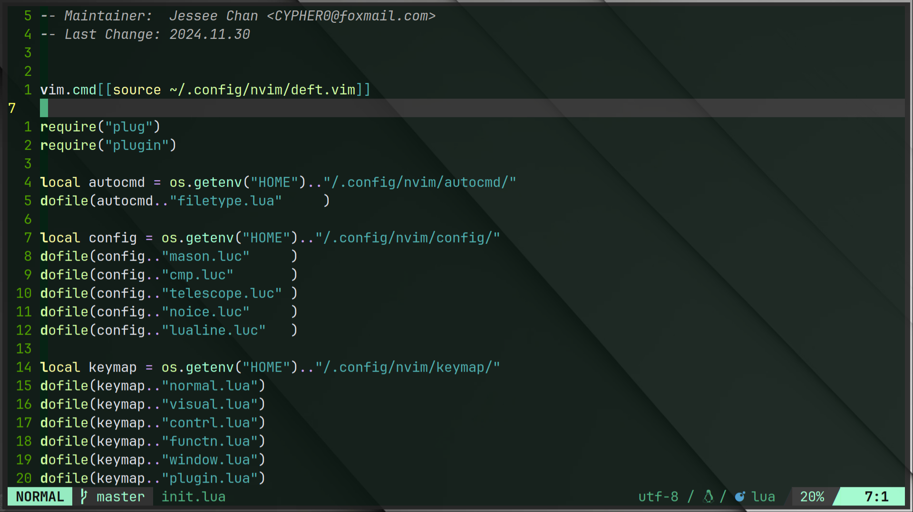

## Misty Colorful theme for nvim  

迷幻多彩主题。  

  

----  

### 📦 Installation 安装  

The path of the actual config file should be modified according to your own `nvim`.  
The following config file path base on `Arch Linux`.  

实际的配置文件的路径应该根据你自己的 `nvim` 进行修改。  
以下的配置文件的路经基于`Arch Linux`。  

#### Install with package manager 包管理器安装  

##### [lazy.nvim](https://github.com/folke/lazy.nvim)  

```lua  
{"ovwxxwvo/misty.nvim"}  
```  
Add this line to your yazi config file `~/.config/nvim/init.lua` :  
```lua  
require("misty")  
```  

#### Install manually 手动安装  

Clone the repo to your nvim config dir :  
```  
git clone https://github.com/ovwxxwvo/misty.nvim.git ~/.config/nvim/colors/  
ln -s ~/.config/nvim/colors/misty.nvim/lua/misty /home/oo/.config/nvim/lua  
```  
Add this line to your nvim config file `~/.config/nvim/init.lua` :  
```  
require("misty")  
```  

----  

### 🛠️ Configuration 配置  

Customize your configuration file.  
```sh  
mkdir ~/.config/nvim/config  
touch ~/.config/nvim/config/misty.luc  
vi    ~/.config/nvim/config/misty.luc  
```  
Add this line to your nvim config file `~/.config/nvim/init.lua` :  
```lua  
local config = os.getenv("HOME").."/.config/nvim/config/"  
local set_wins = require("misty/util").set_wins  
set_wins(dofile(config.."misty.luc"     ))  
```  

Or you can just directly modify the config file in the plugin :  
```sh  
vi ~/.config/nvim/colors/misty.nvim/lua/misty/basic.lua  
vi ~/.config/nvim/colors/misty.nvim/lua/misty/syntax.lua  
```  

----  

### 📚 Suggestion 建议  

Your app, Your rule. Feel free to modify the files.  
*Another plugin for `tmux`, used to set the bg color.  ([misty.tmux](https://github.com/ovwxxwvo/misty.tmux.git))*  

& some suggestions for settings outside the plugin.  
- Maybe a gray-textured wallpaper will be better fit this.  
- Also a little transparency in the terminal emulator, about 80%|90%.  

& some personal preference settings inside the plugin, change it to your own.  
- dark  seagreen `#0d1a14` as the bg color for  `nvim`.  

你的应用，你说了算。不要害怕修改文件。  

& 一些在插件之外的设定建议。  
- 也许一张灰色纹理的壁纸会更适配。  
- 且一点透明度在终端模拟器中，大约 80%|90%。  

& 一些在插件内部的个人喜好设定，更换为你的喜好。  
- 深海绿 `#0d1a14` 作为  `nvim`  的背景色。  

----  

### 📜 [MIT](LICENSE) License 许可证  


